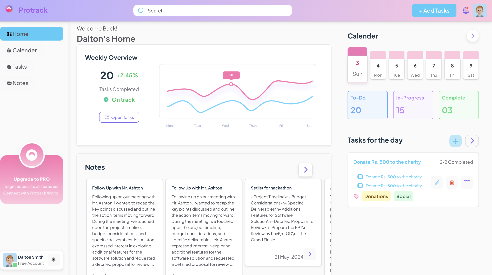
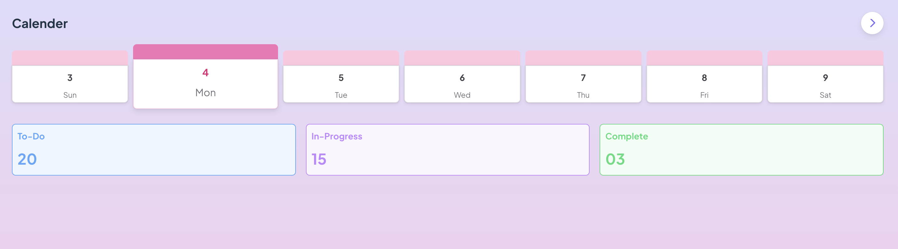
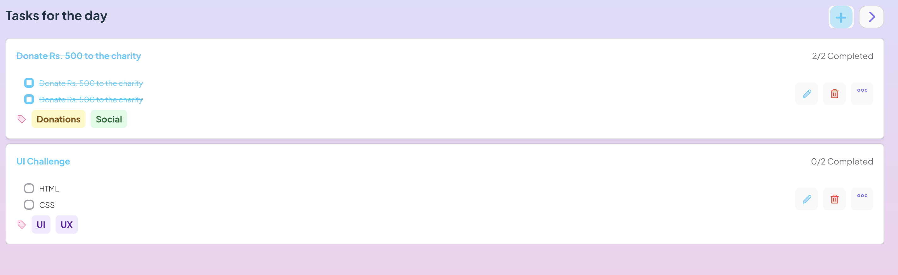
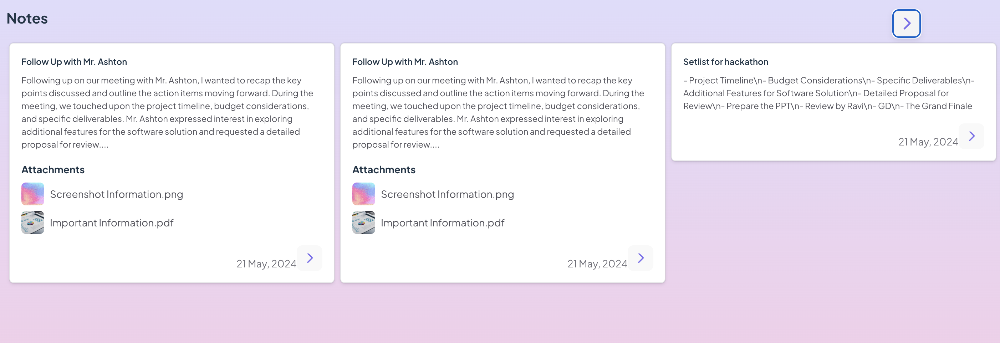
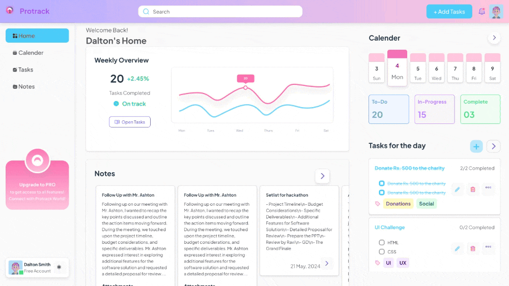
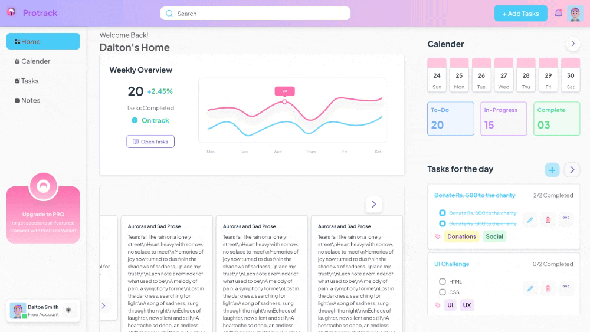

# Dashboard UI

A single page Dashboard UI

## Tools Used

- React
- Chakra UI
- Redux
- react-router-dom
- Vite
- Eslint
- Prettier

Functionalities:

## Route into different components

### HOME

### Calender

### Tasks

### Notes

## Scrollable Calendar

## Scrollabel Notes Section

## Add Tasks Modal

## Delete task

